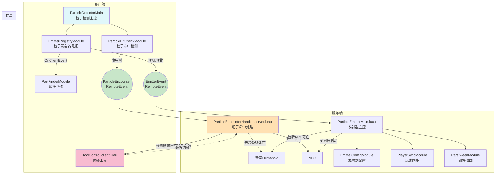

# 永夜行动 项目模块化概览

## 1. 项目结构分层

- **ServerScriptService/**
  - 服务端核心逻辑（如粒子命中处理）
- **StarterPack/**
  - 玩家可用工具（如伪装、武器）
- **StarterPlayer/StarterPlayerScripts/**
  - 客户端检测与交互（如粒子检测、命中判定）
- **Workspace/**
  - 场景与NPC实体、粒子发射器等

## 2. 主要模块说明

- **粒子检测系统（客户端）**
  - `ParticleDetectorMain.luau`：客户端主控，初始化注册与检测
  - `EmitterRegistryModule.luau`：管理所有粒子发射器的注册与同步
  - `ParticleHitCheckModule.luau`：实时检测玩家是否进入粒子扇形区域，命中时触发远程事件
  - `PartFinderModule.luau`：根据配置查找场景中的粒子发射部件

- **粒子发射与同步系统（服务端）**
  - `ParticleEmitterMain.luau`：服务端主控，负责发射器配置、同步、动画、NPC死亡监听
  - `EmitterConfigModule.luau`：发射器参数配置与创建
  - `PlayerSyncModule.luau`：将发射器信息同步给所有客户端
  - `PartTweenModule.luau`：发射器部件动画

- **粒子命中与伪装判定（服务端）**
  - `ParticleEncounterHandler.server.luau`：处理客户端命中事件，判定玩家是否装备伪装，未装备则判定死亡
  - `ToolControl.client.luau`：伪装工具逻辑，冷却与自动脱下

- **远程事件（共享）**
  - `EmitterEvent`：发射器注册/注销同步
  - `ParticleEncounter`：粒子命中事件

## 3. 核心系统交互图

---

> 本文档遵循团队Robo项目开发规范，所有模块均已按功能分层，交互流程清晰，便于后续扩展与维护。 